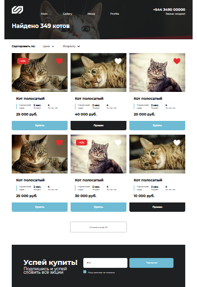

# Тестовое задание от компании Alef Development

Макет страницы: https://www.figma.com/file/UXn4IQQqHM2TdpIpNJPeFt/T-Task?node-id=0%3A1

## Суть задания:

Сверстать страницу по макету.

**Вёрстка**:

1. Адаптивная (дофантазировать мобильную и планшетную версию).

2. Максимальная ширина контентной части сайта - 1280px. На мониторах шире контент центрируется.

3. Кроссбраузерная. Страница должна одинаково смотреться в современных браузерах и не разваливаться в IE11.

4. Нельзя использовать CSS фреймворки (Bootstrap, Foundation).

5. Стилизовать чекбокс. Помнить о всех возможных состояниях ссылок, инпутов, кнопок. Имеются ввиду :hover, :active.

**JavaScript**:

1. Реализовывать сортировку. При клике на поле сортировки “Цене” или “Возраст” карточки должны сортироваться по выбранному полю.

2. Реализовать работу кнопки “наверх”. При клике должна произойти плавная прокрутка вверх страницы. Если прокрутка невозможна, то кнопка скрывается.

3. Валидация формы: если email неподходящего вида, то выдавать ошибку.

4. При клике на сердце показывать уведомление о добавлении в избранное.